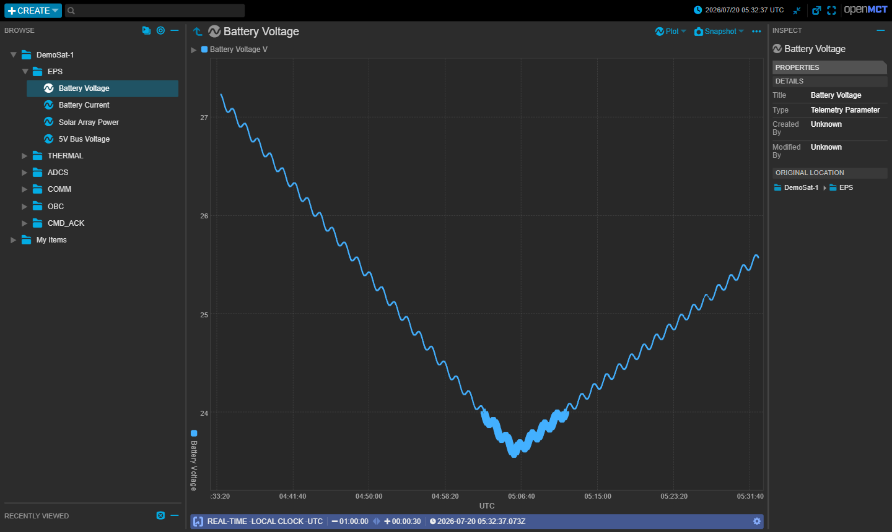
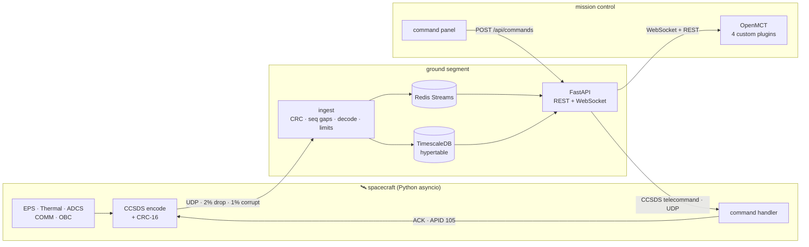
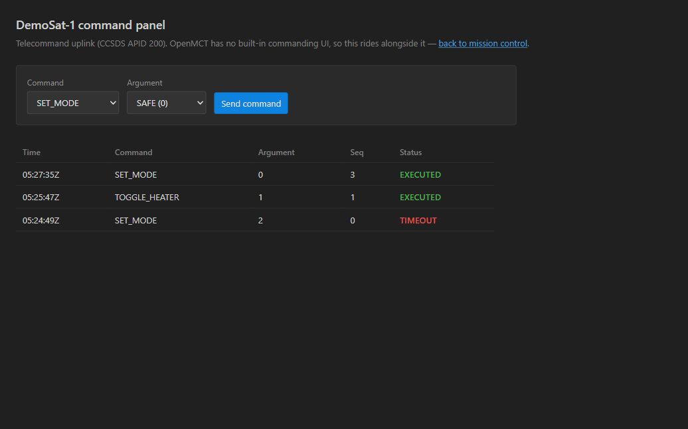

# DemoSat-1 — Real-Time Spacecraft Telemetry & Mission Control

An end-to-end ground segment for a simulated satellite, built with the
protocols and tools real missions use. A spacecraft simulator downlinks
**CCSDS Space Packets** over a lossy UDP "space link"; the ground segment
validates, decodes, limit-checks, archives and streams them; and
**NASA OpenMCT** — the open-source mission control framework flown at JPL
and Ames — renders it live. Commands go back up the same way.



*One orbit of battery voltage: discharge through eclipse, recharge in
sunlight, with the dip below 24 V flagged against its yellow limit.*

## Quickstart

```bash
docker compose up --build -d
```

Open **<http://localhost:8080>** and expand `DemoSat-1` in the tree. Drop
any parameter on a plot; set the time conductor to *Realtime* to watch it
tick, or *Fixed* to replay recorded history.

The command panel lives at **<http://localhost:8080/commands.html>**.

```bash
docker compose logs -f ingest     # watch telemetry decode in real time
pytest tests/                     # 32 unit tests
docker compose down
```

## Architecture



Everything is driven by one file — `config/telemetry_dictionary.yaml`. It
defines every packet, parameter, type, unit, limit and command. The
spacecraft encoder and the ground decoder read *the same file*, so they
cannot drift apart, and byte offsets are derived from field order rather
than hand-maintained. Add a parameter there and it appears in OpenMCT
automatically.

## Tech stack

| Layer | Technology | Why |
|---|---|---|
| Wire protocol | **CCSDS Space Packet Protocol** | The international standard real spacecraft use |
| Integrity | CRC-16/CCITT-FALSE, 14-bit sequence counters | Detect corruption and missing packets |
| Flight software | Python 3.12 · asyncio | Subsystem simulation, telecommand handling |
| Ingest | Python · asyncio UDP server | Validation, decode, limit checking |
| Message bus | **Redis Streams** | Real-time fan-out, replayable buffer |
| Archive | **TimescaleDB** (Postgres) | Time-series hypertable for historical replay |
| API | **FastAPI** · WebSocket | Realtime push + historical REST |
| Mission control | **NASA OpenMCT 4.2** | The real thing, with custom telemetry plugins |
| Orchestration | Docker Compose | One command, six services |

## What it implements

**Telemetry downlink** — Five subsystems sampled at 1 Hz, each encoded as a
CCSDS Space Packet with a 6-byte primary header (version, type, APID,
14-bit sequence count), an 8-byte secondary header carrying a timestamp, a
dictionary-defined payload, and a CRC-16 trailer.

**A physically plausible spacecraft** — A 90-minute low-Earth orbit with a
40% eclipse fraction drives everything: solar array power follows the sun
angle, the battery discharges in shadow and recharges in sunlight, and
component temperatures track the same eclipse state.

**Link degradation** — The downlink drops ~2% of packets and corrupts ~1%
(configurable). Ingest rejects every corrupted packet on CRC and reports
per-APID sequence gaps, correctly handling the 14-bit counter wrapping at
16384.

**Limit checking** — Yellow/red thresholds per parameter, evaluated
server-side against the shared dictionary. Alarm events are emitted only on
*transitions*, not every sample.

**Historical replay** — Every sample lands in a TimescaleDB hypertable, so
OpenMCT's time conductor can scrub back through the mission.

**Command uplink** — CCSDS telecommands with acknowledgement correlation.



Commands are correlated on `(command_id, sequence_count)` rather than
command id alone, so repeating a command can't cross wires. `TOGGLE_HEATER`
has a real physical effect (+8 °C on battery temperature), so an uplinked
command is observable in downlinked telemetry rather than only in a status
field. A command whose acknowledgement is lost to the link reports
`TIMEOUT` — which is exactly why flight controllers verify commands against
telemetry rather than trusting acknowledgements alone.

## Try the interesting parts

**Watch the link degrade.** Raise the corruption rate and watch ingest
reject packets while the archive stays clean:

```bash
CORRUPT_PROB=0.3 docker compose up -d spacecraft
docker compose logs -f ingest          # CRC failures and sequence gaps
curl localhost:8080/api/link           # running link-quality counters
```

**Command the spacecraft and watch telemetry respond.**

```bash
curl -X POST localhost:8080/api/commands \
     -H 'Content-Type: application/json' -d '{"id":2,"arg":1}'   # heater ON
```

Then plot `THERMAL → Battery Temperature` — the step is immediate.

**Inspect the bus and the archive directly.**

```bash
docker compose exec redis redis-cli XREVRANGE telemetry.decoded + - COUNT 1
docker compose exec timescaledb psql -U postgres -d telemetry \
  -c "SELECT parameter, count(*) FROM telemetry GROUP BY 1 ORDER BY 2 DESC;"
```

## Running alongside other Docker projects

Built to share a Docker engine without disturbing anything else on the
machine — it claims one port, caps its own resources, and never starts
itself uninvited.

| Property | Value |
|---|---|
| Compose project | `demosat-groundstation` |
| Network / volume | `demosat_net` / `demosat_timescale-data` |
| Published host ports | **8080 only** |
| Resource ceiling | ~2 GB RAM / 3 CPUs (idles ~140 MiB) |
| Restart policy | `on-failure:3` — bounded, no auto-start at Docker boot |

Names are explicit rather than derived from the directory, so cloning or
renaming the folder can't collide with another project. The API and
database are internal-only — the browser reaches them through the nginx
proxy on 8080 — leaving ports 8000, 5432 and 6379 free for anything else
you run.

| Service | CPU | Memory | Published |
|---|---|---|---|
| `missioncontrol` (nginx + OpenMCT) | 0.25 | 128 M | **8080** |
| `api` (FastAPI) | 0.5 | 256 M | internal |
| `ingest` | 0.5 | 256 M | internal |
| `spacecraft` | 0.25 | 128 M | internal |
| `timescaledb` | 1.0 | 1 G | internal |
| `redis` | 0.5 | 256 M | internal |

### Direct API / database access

`curl` and `psql` need an opt-in overlay that binds them to loopback only,
on high ports chosen to stay clear of typical dev servers:

```bash
docker compose -f docker-compose.yml -f docker-compose.debug.yml up -d
curl 127.0.0.1:18000/api/link
psql -h 127.0.0.1 -p 15432 -U postgres telemetry
```

Without it those ports are closed. You can always reach the API through the
proxy (`localhost:8080/api/...`) or the database via
`docker compose exec timescaledb psql -U postgres -d telemetry`.

### Docker Desktop instability on Windows

If Docker Desktop crashes when several projects run at once, the usual
cause is that WSL2 has no memory cap — by default its VM can take ~50% of
host RAM plus every CPU, and returns memory to Windows only lazily. Cap it
in `C:\Users\<you>\.wslconfig`:

```ini
[wsl2]
memory=8GB
processors=8
swap=2GB

[experimental]
autoMemoryReclaim=gradual
```

Quit Docker Desktop first so databases checkpoint cleanly, then
`wsl --shutdown`, then reopen it. Container data lives in named volumes on
the WSL virtual disk and survives this.

## Layout

```
config/telemetry_dictionary.yaml   single source of truth
shared/            CCSDS codec, CRC-16, dictionary loader
spacecraft/        simulator, subsystems, lossy link, command handler
ground/ingest/     UDP server, decode, link monitor, limits, sinks
ground/api/        FastAPI: dictionary, history, WebSocket, commands
missioncontrol/    OpenMCT + 4 plugins, command panel, nginx proxy
db/init.sql        TimescaleDB hypertable
tests/             32 unit tests
```

The `shared/` package stays Python 3.9-compatible so tests run on a bare
local interpreter, while the services run 3.12 in containers.

## Testing

```bash
pytest tests/
```

Covers the CCSDS codec (round-trip for every APID, the CRC-16 `0x29B1`
known-answer vector, corruption detection, 14-bit sequence wraparound),
sequence-gap detection including wraparound, limit boundaries and alarm
transitions, and the command path (execution, rejection, ACK correlation,
and dropping un-acknowledgeable corrupted uplinks).
